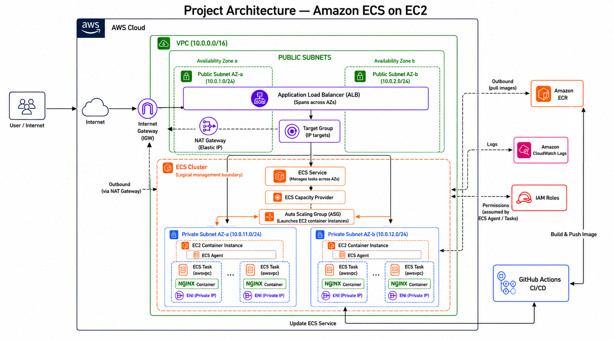

# AWS ECS on EC2 Architecture Upgrade

This project represents an upgraded AWS ECS on EC2 deployment architecture based on the previous [aws-ecs-on-ec2-cicd](https://github.com/useruser300/aws-ecs-on-ec2-cicd) project.

The main improvement is moving from a simple public-subnet ECS design to a more production-style design using:

- Private Subnets
- NAT Gateway
- `awsvpc` network mode
- IP-based Target Group
- ECS Tasks with private IPs

## Architecture Diagram



## Previous Design

The previous design used a simpler ECS on EC2 setup:

```text
Internet
  |
Application Load Balancer
  |
ECS EC2 Instances in Public Subnets
  |
ECS Tasks using bridge network mode
```

In that design, ECS container instances were placed in public subnets, and the ECS tasks used Docker bridge networking with dynamic host ports.

## Upgraded Design

The upgraded design separates public and private resources:

```text
Internet
  |
Application Load Balancer in Public Subnets
  |
Target Group with IP targets
  |
ECS Tasks in Private Subnets using awsvpc
  |
ECS EC2 Instances managed by Auto Scaling Group
```

In this version, the ALB remains public, while the ECS EC2 instances and ECS tasks run inside private subnets.

## Key Differences

| Area | Previous Design | Upgraded Design |
|---|---|---|
| ECS EC2 Instances | Public Subnets | Private Subnets |
| ECS Tasks | Behind EC2 dynamic host ports | Own private IP using `awsvpc` |
| Network Mode | `bridge` | `awsvpc` |
| Target Group Type | `instance` | `ip` |
| Internet Access for ECS | Direct through public subnet | Outbound through NAT Gateway |
| Security Model | ALB forwards to EC2 host ports | ALB forwards to ECS Task private IPs |

## Why This Upgrade Matters

This design is closer to a real production architecture because the application compute layer is no longer directly exposed to the internet.

The public layer contains only internet-facing components such as the Application Load Balancer and NAT Gateway, while the ECS container instances and tasks remain private.

## Final Architecture Summary

```text
Public Subnets:
- Application Load Balancer
- NAT Gateway

Private Subnets:
- ECS EC2 Container Instances
- ECS Tasks
- Nginx Containers

External Services:
- Amazon ECR
- Amazon CloudWatch Logs
- IAM Roles
- GitHub Actions CI/CD
```


