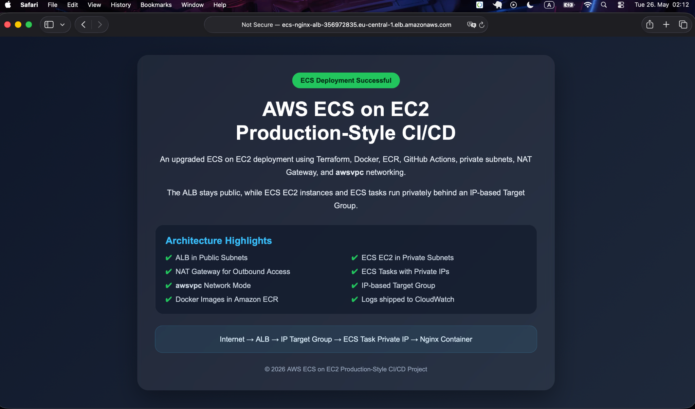
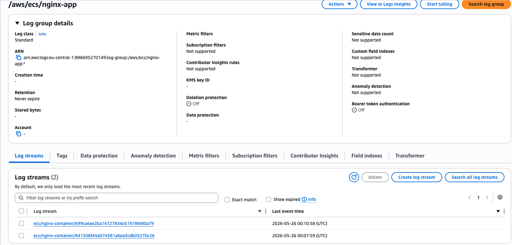
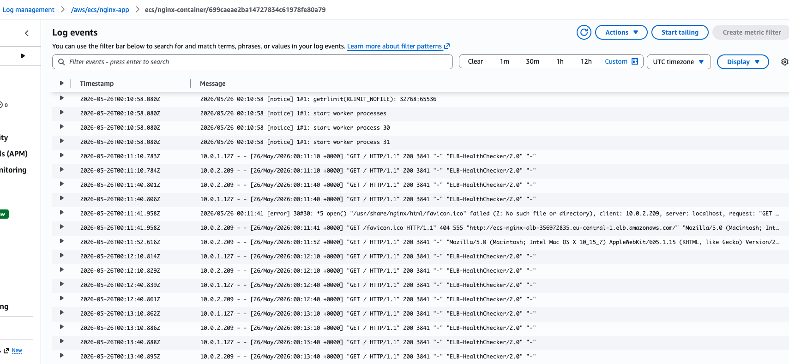
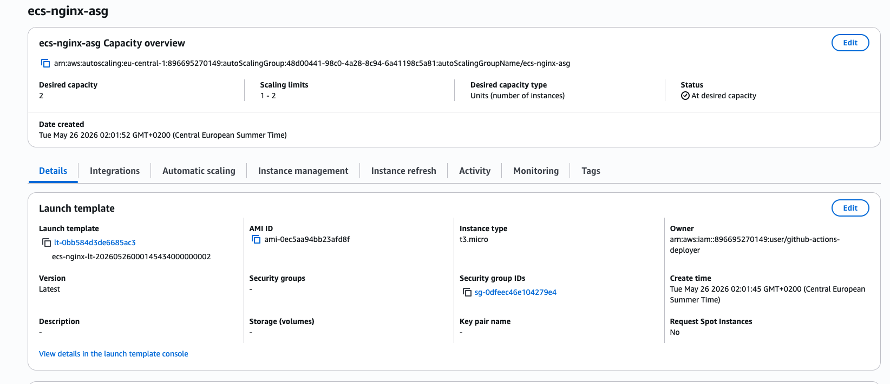
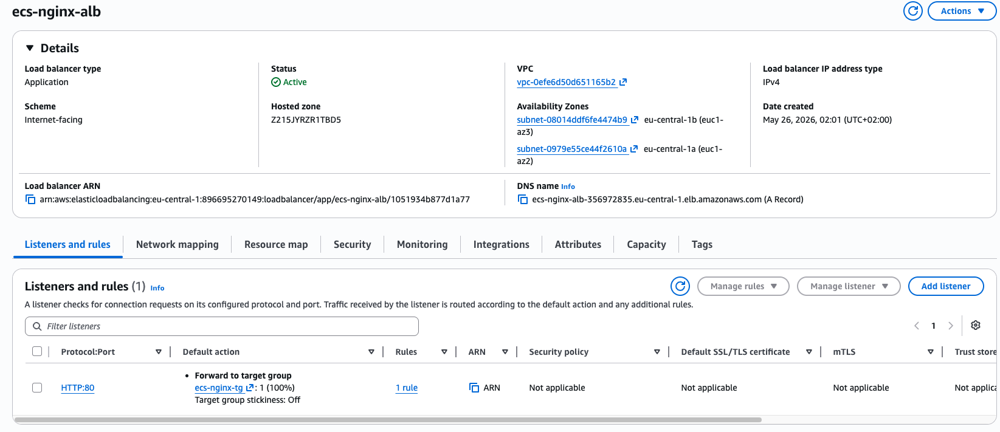
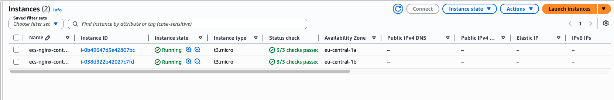
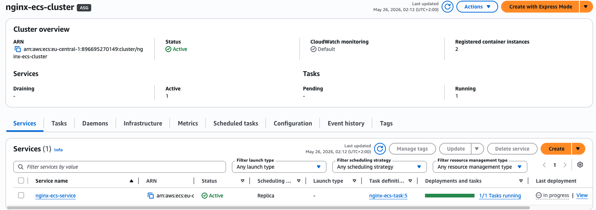

# AWS ECS on EC2 Architecture Upgrade

This project represents an upgraded AWS ECS on EC2 deployment architecture based on the previous [aws-ecs-on-ec2-cicd](https://github.com/useruser300/aws-ecs-on-ec2-cicd) project.

The main improvement is moving from a simple public-subnet ECS design to a more production-style design using:

- Private Subnets
- NAT Gateway
- `awsvpc` network mode
- IP-based Target Group
- ECS Tasks with private IPs

## Architecture Diagram


## Previous Design

The previous design used a simpler ECS on EC2 setup:

```text
Internet
  |
Application Load Balancer
  |
ECS EC2 Instances in Public Subnets
  |
ECS Tasks using bridge network mode
```

In that design, ECS container instances were placed in public subnets, and the ECS tasks used Docker bridge networking with dynamic host ports.

## Upgraded Design

The upgraded design separates public and private resources:

```text
Internet
  |
Application Load Balancer in Public Subnets
  |
Target Group with IP targets
  |
ECS Tasks in Private Subnets using awsvpc
  |
ECS EC2 Instances managed by Auto Scaling Group
```

In this version, the ALB remains public, while the ECS EC2 instances and ECS tasks run inside private subnets.

## Key Differences

| Area | Previous Design | Upgraded Design |
|---|---|---|
| ECS EC2 Instances | Public Subnets | Private Subnets |
| ECS Tasks | Behind EC2 dynamic host ports | Own private IP using `awsvpc` |
| Network Mode | `bridge` | `awsvpc` |
| Target Group Type | `instance` | `ip` |
| Internet Access for ECS | Direct through public subnet | Outbound through NAT Gateway |
| Security Model | ALB forwards to EC2 host ports | ALB forwards to ECS Task private IPs |

## Why This Upgrade Matters

This design is closer to a real production architecture because the application compute layer is no longer directly exposed to the internet.

The public layer contains only internet-facing components such as the Application Load Balancer and NAT Gateway, while the ECS container instances and tasks remain private.

## Final Architecture Summary

```text
Public Subnets:
- Application Load Balancer
- NAT Gateway

Private Subnets:
- ECS EC2 Container Instances
- ECS Tasks
- Nginx Containers

External Services:
- Amazon ECR
- Amazon CloudWatch Logs
- IAM Roles
- GitHub Actions CI/CD
```

## Deployment Verification

The deployment was verified successfully after applying the upgraded ECS on EC2 architecture.

The application is reachable through the public Application Load Balancer DNS name, while the ECS EC2 container instances and ECS tasks remain private inside the VPC.

### 1. Application Access Through ALB

The Nginx application was accessed successfully from the browser using the public ALB DNS name.



This confirms that the external request path is working correctly:

```text
Internet
  |
Application Load Balancer
  |
IP-based Target Group
  |
ECS Task Private IP
  |
Nginx Container
```

### 2. CloudWatch Log Group

The ECS task logs are shipped to Amazon CloudWatch Logs under the log group:

```text
/aws/ecs/nginx-app
```



The log group contains active log streams for the running ECS tasks.

### 3. Nginx Log Events

The CloudWatch log stream shows Nginx startup messages, ALB health checks, and HTTP requests to the application.



The logs confirm that:

- Nginx started successfully inside the container.
- ALB health checks are reaching the task.
- Browser requests are reaching the application.
- The container is writing logs to CloudWatch.

### 4. Auto Scaling Group

The ECS EC2 instances are managed by an Auto Scaling Group named:

```text
ecs-nginx-asg
```



The Auto Scaling Group is running with:

- Desired capacity: `2`
- Minimum capacity: `1`
- Maximum capacity: `2`
- Instance type: `t3.micro`

This confirms that ECS capacity is managed through an Auto Scaling Group.

### 5. Application Load Balancer

The Application Load Balancer is active and internet-facing.



The ALB listener is configured on:

```text
HTTP:80
```

The listener forwards traffic to the target group:

```text
ecs-nginx-tg
```

The target group type is IP-based, which matches the `awsvpc` networking model used by ECS tasks.

### 6. Private ECS EC2 Instances

The ECS EC2 container instances are running without public IPv4 addresses.



This confirms that the compute layer is private and not directly exposed to the internet.

### 7. ECS Cluster and Service

The ECS cluster is active and has registered container instances.



The ECS service is active and running the desired task count:

```text
1/1 tasks running
```

This confirms that the ECS service successfully deployed the Nginx task and attached it to the load-balanced architecture.

## Verification Summary

| Component | Status |
|---|---|
| Application Load Balancer | Active |
| ALB Listener | HTTP:80 |
| Target Group | IP-based target group |
| ECS Cluster | Active |
| ECS Service | Active |
| ECS Task | Running |
| ECS EC2 Instances | Running privately |
| Auto Scaling Group | At desired capacity |
| CloudWatch Logs | Receiving logs |
| Browser Test | Successful |

## Final Request Flow

```text
User Browser
  |
Public ALB DNS Name
  |
Application Load Balancer
  |
HTTP Listener :80
  |
IP-based Target Group
  |
ECS Task Private IP
  |
Nginx Container
  |
CloudWatch Logs
```

The deployment is now verified as a working ECS on EC2 production-style CI/CD architecture using private subnets, NAT Gateway, `awsvpc` networking, IP-based target groups, CloudWatch logging, and GitHub Actions deployment.

